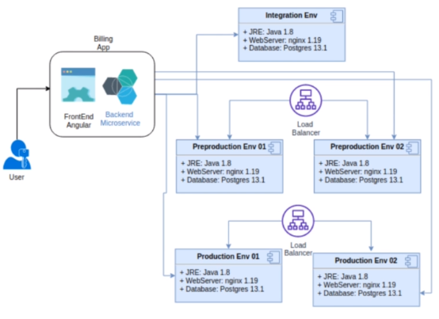
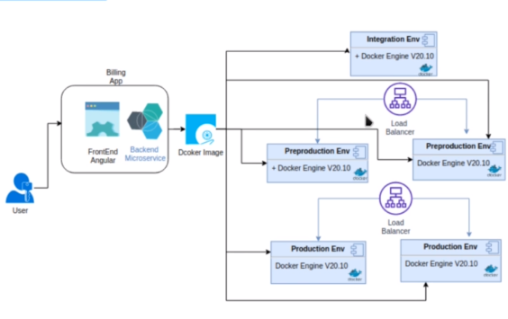
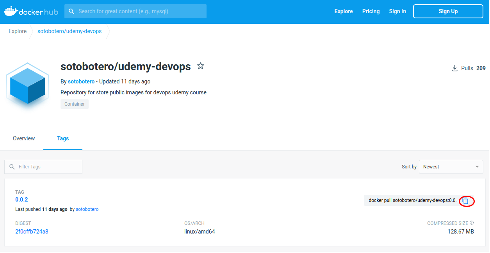

# Docker
# 

  1. [Caso de estudio](#case)
  2. [Comandos iniciales](#comand)
  3. [Imagen de docker para la aplicación de facturación](#imagen)
  4. [Comandos de supervivencia](#docker-commands)
  5. [Docker Hub](#docker-hub)
  6. [Docker compose](#docker-compose)
 


<hr>

<a name="case"></a>

## 1. Caso de estudio
- Se requiere desplegar la aplicación de facturación de la compañía en los entornso de integración, preproducción y producción
- Las instalaciones debe contar alta disponibilidad, excepto en integracción
### Requisitos mínimos
* Java 1.8
* Servidor Web Nginx
* Bases de datos Postgres

Si tuviésemos que implementar esta solución de forma tradicional, deberíamos replicar la instalación y configuración de Java, Nginx y Postgres en las 5 máquinas que darían el servicio para tener levantados los tres entornos. Además, si necesitamos escalar para mantener la disponibilidad, deberemos hacer lo mismo en cada una de las nuevas máquinas.



Este diagrama se simplifica mediante el uso de imágenes de docker, ya que sólamente hacemos la instalación y configuración de las herramientas necesarias una vez en el contenedor de docker. Luego este contenedor se utilizará en el Docker Engine en cada una de las máquinas que sea necesaria.




<hr>

<a name="comand"></a>

## 2. Comandos usados
Comprobamos que docker esté activo y arrancado
~~~
sudo service docker status
~~~
Crear un grupo para no tener que estar usando siempre la palabra `sudo` a la hora de usar comandos de docker
~~~
sudo groupadd docker
~~~
Agregarmos nuestro usuario actual a ese grupo de docker
~~~
sudo usermod -aG docker $USER
~~~

Ejecute el siguiente comando o Cerrar sesión e iniciar sesión nuevamente y ejecutar
~~~
newgrp docker
~~~
Intalación de docker compose

~~~
sudo curl -L "https://github.com/docker/compose/releases/download/1.28.4/docker-compose-$(uname -s)-$(uname -m)" -o /usr/local/bin/docker-compose
~~~
Permiso de ejecución
~~~
sudo chmod +x /usr/local/bin/docker-compose
~~~

Enlace simbólico
~~~
sudo ln -s /usr/local/bin/docker-compose /usr/bin/docker-compose
~~~
Version de docker
~~~
docker-version --version
~~~

<hr>

<a name="imagen"></a>

## 3. Imagen de docker para la aplicación de facturación

Vamos a usar esta [imagen](https://hub.docker.com/r/sotobotero/udemy-devops/).

Vamos a la pestaña tags y copiamos el comando para descargar la imagen de docker.
~~~
docker pull sotobotero/udemy-devops:0.0.2
~~~



Ejecutamos el contenedor a través del comando:
~~~
docker run -p 80:80 -p 8080:8080 --name billingapp sotobotero/udemy-devops:0.0.2
~~~

Una vez levantado el contenedor, podemos acceder al frontal de la imagen en `localhost:80` y al frontal disponible en el microservicio en `localhost:8080/swagger-ui/index.html.`


<hr>

<a name="docker-commands"></a>

## 4. Comandos de supervivencia

- **Listar imágenes**
```docker image ls```

- **Elminar una imagen**
```docker image rm <imagen>```

- **Eliminar todas las imágenes**
```docker image rm $(docker image ls)```

- **Listar contenedores**
```docker ps -a```

- **Inicializar un contenedor**
```docker start <contenedor>```

- **Detener un contenedor**
```docker stop <contenedor>```

- **Eliminar un contenedor**
```docker container rm <contenedor>```

- **Eliminar todos los contenedores detenidos**
```docker rm $(docker ps -a -q)```

- **Visualizar los logs de un contenedor**
```docker logs <contenedor>```

- **Elminar un contenedor**
```docker rm <contenedor>```


<hr>

<a name="docker-hub"></a>

## 5. Docker hub
Es un repositorio de imagénes de docker, [Docker Hub](https://hub.docker.com/)

Las distintas plataformas publican sus imágenes oficiales de sus servicios para poder utilizarlas en nuestros proyectos.


<hr>

<a name="docker-compose"></a>

## 6. Docker compose: orquestar un servicio con dos imágenes
Docker-compose  permite simplificar el uso de Docker para crear contendores, conectarlos, habilitar puertos, volumenes, etc... a partir de archivos YAML.

Con Compose podemos crear diferentes contenedores y al mismo tiempo, en cada contenedor, diferentes servicios, unirlos a un volúmen común, iniciarlos y apagarlos, etc. Es un componente fundamental para poder construir aplicaciones y microservicios.

- Vamos a utilizar una imagen de Postgres. En docker-hub, en la información de la imagen oficial vemos que podemos descargarla con el comando...
~~~
docker pull postgres
~~~
- Para levantar el contenedor de forma local podemos utilizar el comando...
~~~
docker run --name some-postgres -e POSTGRES_PASSWORD=mysecretpassword -d postgres 
~~~

- O bien utilizar un archivo de configuración que le pasaremos a docker-compose:

~~~yaml
version: '3.1'

services:

  db:
  container_name: postgres
    image: postgres
    restart: always
    environment:
      POSTGRES_USER: postgres
      POSTGRES_PASSWORD: querty
      POSTGRES_DB: postgres
    ports:
      - 5432:5432

  adminer:
    container_name: adminer
    image: adminer
    restart: always
    depends_on:
      - db
    ports:
      - 9090:8080
~~~

Como norma general, el archivo que utilizaremos para guardar esta configuración sera docker-compose.yml. Si lo llamamos de otra forma (si tenemos varios archivos de configuración distintos), debemos especificarlo en la ejecución de docker-compose.

Para descargar las imágenes utilizamos el comando
~~~
docker-compose pull
~~~
o bien el siguiente comando si nuestra configuración está en un archivo de configuración con un nombre distinto:
~~~
docker-compose -f <nombre> pull
~~~

Para levantar los servicios asociados usaremos el comando:
~~~
docker-compose up -d
~~~
-d permite levantar el contenedor en modo daemon.

Ahora en en navegador podemos navegar a ```localhost:9090``` para acceder a la interfaz de adminer que conecta con el motor de base de datos de postgres.

Para bajar los servicios que están levantados, podemos hacerlo uno a uno o bien a través del archivo de configuración mediante el comando:
~~~
docker-compose down
~~~